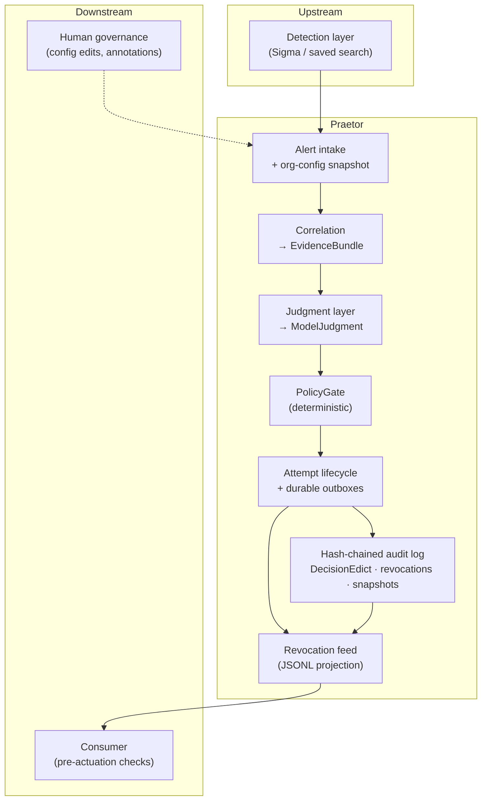

# Praetor

[](https://www.python.org/downloads/)
[](#getting-started)
[](#where-we-are)
[](docs/plan.md)

> **Elevator pitch:** Detection tells you something fired. Praetor decides what happens next — with LLM judgment you can actually trust, because every action passes deterministic policy gates and lands in a tamper-evident audit trail.

**Post-detection disposition engine for SOCs** — contextual LLM judgment, constrained by contracts, deterministic policy gates, and a tamper-evident audit trail.

Detection answers *did something fire?* Praetor answers *what do we do about it?* It consumes alerts your SOC already produces and emits reviewable dispositions (and optional containment directives) that downstream SOAR/EDR can act on. It is an add-on, not a platform replacement.

---

## Why this project

Most triage today is either **every alert to a human** (slow, fatiguing) or **hand-maintained if-then trees** (brittle, and still blind to org-specific context). Praetor's bet is different:

> An LLM can render contextual judgment — and that judgment becomes trustworthy when it is wrapped in stable contracts, schema-enforced citations, deterministic safety controls, and a reviewable audit trail.

**The model recommends. The system authorizes.** Intelligence may be non-deterministic; the authority to act is not.

---

## What makes it interesting

| Property | What it means in practice |
|---|---|
| **Three dispositions, no hiding** | `standard_review`, `escalate`, `auto_contain` — no `auto_close`. Uncertainty always falls to human review. |
| **Machine-checkable citations** | Model rationale must cite evidence IDs or field paths that resolve in the bundle; bad citations downgrade to escalate. |
| **Deterministic containment gates** | `auto_contain` only after citations, never-contain checks, rate limits, circuit breakers, feed health, and idempotency all pass. |
| **Org config as statute** | Human-authored, versioned config is rendered in full into judgment context — safety sections are never silently omitted. |
| **Honest audit semantics** | Hash-chained ledger detects tampering; cases are human-reconstructable. We do not overclaim immutability or LLM replay. |
| **Portable by design** | Versioned Pydantic contracts, exported JSON Schema, canonical hashing — built to hand decisions to another SOC's stack. |

---

## Architecture

Praetor sits **after** detection. It correlates local telemetry, asks an LLM for structured judgment against org config, runs a deterministic **PolicyGate**, then durably records the outcome.



**Boundary:** Praetor owns honest directive emission and safety signals (expiry, never-contain snapshot, revocation feed). The **consumer** owns receipt-to-actuation — feed freshness, expiry, local final checks, failing closed when its contract cannot be satisfied.

**Durability model:** SQLite (WAL, single-writer) holds attempt lifecycle and outboxes; the ledger is the audit authority; the revocation feed is a delivery projection, not the system of record.

---

## Design principles

These are the product's load-bearing decisions. Full rationale lives in [`docs/prd.md`](docs/prd.md); behavioral detail in [`docs/spec.md`](docs/spec.md).

1. **Recommendation ≠ authorization** — `ModelJudgment` is a proposal; `PolicyGate` decides the final disposition. Auditors can tell "model assessed low risk" from "model wanted contain but policy blocked it."

2. **Fail safe, fail loud** — `standard_review` and `escalate` both route to humans. The only automated action is `auto_contain`, and it is gated, bounded, and reviewable.

3. **Citations are enforced, not decorative** — Fluent prose without resolvable citations is a hallucination failure mode; the Outcome Matrix treats it as escalate.

4. **Safety config is complete, not curated** — Token budgets may shrink config, but never by dropping safety-critical sections the model did not happen to mention.

5. **Feedback is human-gated** — Analyst annotations inform a SOC lead who deliberately edits config. No self-tuning containment authority.

6. **Contracts before code** — Hash domains, ID derivations, and the Outcome Matrix are ratified in [`docs/contracts.md`](docs/contracts.md) before implementation. Silent cross-site divergence is treated as a bug.

---

## Where we are

**Phase 1 is complete:** the durable walking skeleton is built and verified.
That means Praetor now has the safety-critical foundation: stable contracts,
canonical hashes, SQLite lifecycle state, startup guards, org config activation,
never-contain handling, the hash-chained audit ledger, revocation-feed export,
ticket/health outboxes, and a minimal end-to-end decision path.

In non-technical terms: the foundation is poured, the safety rails are installed,
and the system can already show how a decision is recorded and recovered after
failure. It is not yet connected to a real LLM provider or a real SOC data stream.
That comes next.

### Phase Structure

| Phase | Tasks | Plain-English milestone | Status |
|---|---:|---|---|
| Phase 1 — Durable walking skeleton | 1-12 | Make decisions durable, auditable, recoverable, and safe-by-default | **Complete** |
| Phase 2 — Judgment and policy discipline | 13-27 | Add provider abstraction, prompt building, PolicyGate, breakers, metrics, evals | Next |
| Phase 3 — Correlation | 28-31 | Build real telemetry correlation and identity compliance gates | Planned |
| Phase 4 — Detection portability | 32-33 | Package Sigma/SPL/Splunk demo flow | Planned |
| Phase 5 — Operator readiness | 34-35 | Org-config sweep, production benchmark, runbooks | Planned |

## What's built so far

**Phase 1 (durable core)** — Tasks 1-12 complete · **~34% of the 35-task plan**

| Area | Status | Location |
|---|---|---|
| Repo, test harness, strict typing, lint | Done | `pyproject.toml`, `pytest`, `mypy`, `ruff` |
| 14 versioned Pydantic v2 contracts + JSON Schema export | Done | `src/praetor/contracts/`, `schemas/` |
| Canonical serialization & hash derivations | Done | `src/praetor/hashing/`, `docs/contracts.md` |
| Auth primitives for role-tagged write surfaces | Done | `src/praetor/auth/` |
| Process singleton + SQLite WAL startup guard | Done | `src/praetor/runtime/`, `src/praetor/state/sqlite_guard.py` |
| Attempt lifecycle, idempotency, revocations in SQLite | Done | `src/praetor/state/` |
| Ticket stamp outbox with idempotent retry semantics | Done | `src/praetor/tickets/` |
| SystemHealthAlert outbox | Done | `src/praetor/alerts/` |
| Org config loader, preflight, activation, emergency never-contain | Done | `src/praetor/config/`, `configs/example_org.yaml` |
| Hash-chained audit ledger + tamper-detection startup hook | Done | `src/praetor/ledger/` |
| Revocation feed exporter + startup feed recovery | Done | `src/praetor/revocation/` |
| Walking skeleton decision flow and crash recovery | Done | `src/praetor/engine/` |
| Smoke benchmark for serialized path | Done | `benchmarks/smoke_serialized_path.py` |

**Not yet:** real LLM provider calls, real prompt construction, PolicyGate,
rate limits, circuit breakers, directive emission, reference consumer verifier,
real correlation, identity compliance, and the Splunk demo harness. The current
walking skeleton uses hardcoded evidence and judgment fixtures so the durability
and safety behavior can be proven before the intelligent parts are added.

---

## Repository layout

```
src/praetor/
├── contracts/     # Versioned domain models (AlertEnvelope, DecisionEdict, …)
├── hashing/       # Canonical serialization, decision_id, stamp_id, feed checksum
├── auth/          # Principal, TokenVerifier, role-guarded surfaces
├── config/        # Org config load/preflight/activation, emergency never-contain
├── engine/        # Walking skeleton intake, edict building, startup recovery
├── ledger/        # Hash-chained audit log and startup integrity checks
├── revocation/    # Sequential revocation-feed JSONL exporter
├── runtime/       # OS singleton lock
├── state/         # SQLite store, attempt FSM, idempotency, revocations
├── tickets/       # Stamp outbox (ticketing integration boundary)
└── alerts/        # SystemHealthAlert outbox

schemas/           # Generated JSON Schema (not authoritative — models are)
docs/              # PRD, spec, plan, contracts (source of truth)
configs/           # Example org config
benchmarks/        # Smoke benchmark for the serialized path
tests/             # Contract, hashing, auth, state, outbox test suites
```

---

## Getting started

**Requirements:** Python 3.11+

```bash
pip install -e ".[dev]"
pytest
python -m praetor.contracts.schema_export   # regenerate schemas/
```

Type-check and lint:

```bash
mypy src
ruff check src tests
```

---

## Documentation

This README is the **showcase**. For depth, use the layered docs — each has a distinct job:

| Document | Read this for… |
|---|---|
| [`docs/prd.md`](docs/prd.md) | **Why** — problem, thesis, product decisions, success criteria |
| [`docs/spec.md`](docs/spec.md) | **What** — architecture, Outcome Matrix, acceptance criteria, non-goals |
| [`docs/plan.md`](docs/plan.md) | **How** — 35 tasks, sprint groupings, phase gates |
| [`docs/contracts.md`](docs/contracts.md) | **Pins** — hash domains, ID constructions, consumer pre-actuation |

---

## Explicit non-goals (v1)

Praetor is **not** a detection engine, severity scorer, live enforcer, external enrichment service, self-learning system, alert suppressor, or computational LLM replay engine. See [`docs/spec.md`](docs/spec.md) for the full fence list and deferred-work roadmap.

---

## Browse It / See It In Action

There is not a product UI yet. The best way to inspect Phase 1 is through the
tests, example config, schemas, and generated artifacts.

| What you want to see | Where to look or what to run |
|---|---|
| The current org policy shape | `configs/example_org.yaml` |
| Public contracts Praetor emits/consumes | `schemas/` and `src/praetor/contracts/` |
| The walking skeleton happy path | `pytest -q tests/engine/test_walking_skeleton.py::test_hardcoded_bundle_produces_valid_decision_edict` |
| Safety downgrades instead of unsafe action | `pytest -q tests/engine/test_walking_skeleton.py::test_config_over_budget_escalates_without_judgment_provider_call` |
| Crash recovery never auto-contains | `pytest -q tests/engine/test_crash_recovery.py::test_crash_at_lifecycle_state_recovery_never_autocontains` |
| Revocation feed startup recovery | `pytest -q tests/runtime/test_feed_startup_recovery.py` |
| Ledger tamper detection | `pytest -q tests/ledger/test_startup_verification.py` |
| Full confidence check | Run `pytest -q`, then `mypy src`, then `ruff check src tests` |

In plain language, Phase 1 can demonstrate:

1. A synthetic alert becomes a durable `DecisionEdict`.
2. Faults like missing correlation, oversized config, or invalid citations become
   human-visible escalations instead of silent or unsafe actions.
3. Every decision is written with audit context into a hash-chained ledger.
4. Never-contain conflicts create revocations and revocation-feed entries.
5. Startup recovery reconciles interrupted work before intake resumes.

End-to-end visual walkthrough is planned for **Phase 4**: Sigma rule → Splunk
detection → Praetor disposition → consumer pre-actuation checks.

<!-- Screenshot placeholder: docs/assets/demo-flow.png -->
<!-- Replace with:  -->

