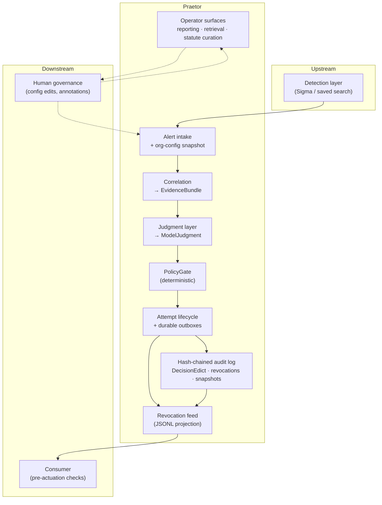

# Praetor

[](https://www.python.org/downloads/)
[](#testing-and-verification)
[](#where-we-are-today)
[](docs/proposals/v2_implementation_plan.md)

> **Elevator pitch:** Detection tells you something fired. Praetor decides what happens next — with LLM judgment you can actually trust, because every action passes deterministic policy gates and lands in a tamper-evident audit trail.

**▶ See it decide:** [`notebooks/praetor_walkthrough.ipynb`](notebooks/praetor_walkthrough.ipynb) — two-act tour of the real engine:

- **Act I:** malicious → `auto_contain` · benign → `standard_review` · never-contain DC **refused**
- **Act II (V2):** temporary corroboration floor (DEC-065) · escalate-by-default · progressive report · exemplars · statute curation · agentic judgment (opt-in)

---

## For executives

### The problem

A SOC's detection layer answers *did something fire?* The expensive question is *what do we do about it?* Today that triage is either a human on every alert (slow, fatiguing) or hand-maintained if-then trees (brittle, and blind to org-specific context). Neither scales, and neither captures the contextual judgment that makes triage hard.

### What Praetor is

Praetor is a **post-detection disposition engine** — an add-on, not a platform replacement. It consumes alerts your SOC already produces and emits reviewable dispositions (and optional containment directives) that downstream SOAR/EDR can act on.

**The model recommends. The system authorizes.** An LLM renders contextual judgment; a deterministic PolicyGate decides what is allowed to happen. Intelligence may be non-deterministic; the authority to act is not.

### What makes it different

| Property | Why it matters |
|---|---|
| **Three dispositions, no hiding** | `standard_review`, `escalate`, `auto_contain` — no `auto_close`. Uncertainty always routes to human review; the product cannot silently make threats disappear. |
| **Machine-checkable citations** | Model rationale must cite evidence that resolves in the alert bundle. Bad citations downgrade to escalate — fluent prose alone is not enough. |
| **Deterministic containment gates** | `auto_contain` only after citations, corroboration, never-contain checks, rate limits, circuit breakers, feed health, and idempotency all pass. Wrong containment is asymmetric and fast; the bar to *act* is inspectable. |
| **Earned authority** | Org config requires an explicit `default_action` (recommended: `escalate`). Containment is allowlisted, not granted by omission. |
| **Org config as statute** | Human-authored, versioned policy is rendered in full into judgment context — safety sections are never silently omitted. |
| **Honest audit semantics** | Hash-chained ledger detects tampering; cases are human-reconstructable. We do not overclaim immutability or LLM replay. |
| **Portable by design** | Versioned contracts, exported JSON Schema, canonical hashing — built to hand decisions to another SOC's stack. |

### Where we are today

**v1 (35 tasks, five phases) and V2 (36 tasks, Gates 0–5) are complete.** In plain terms:

- The foundation is poured: durable state, hash-chained audit log, crash recovery, revocation feed.
- Safety rails are installed: PolicyGate, rate limits, circuit breakers, citation enforcement, provider-health breakers.
- **V2 authorization rewire:** required `default_action`, host corroboration floor, escalate-blocks-containment, correlator host isolation, all containment through PolicyGate.
- **V2 operator features:** progressive authorization reporting (read-only), bounded prompt exemplars + similar-case retrieval (library), statute curation workflow, eval regression locking.
- **Agentic judgment (opt-in):** bounded tool-using `AgenticJudgmentProvider` (source fan-out → hypothesis debate → lead reconciliation) with session evidence registry and `session_trace_hash`; single-shot Vertex/Fake paths remain the default.
- **Temporary corroboration floor (DEC-065):** host/account `auto_contain` needs ≥1 corroboration-eligible anchoring/supporting cite (any telemetry provenance); sole `ambiguity_flag=true` host cite still fails; `ledger_history` is **not** corroboration-eligible. Upgrade flag: restore ≥2 distinct provenance paths when real multi-source telemetry lands.
- Real telemetry correlation feeds judgment on the production intake path.
- Detection rules are portable: Sigma rules compile to SPL with a Splunk Free demo path.
- Operators have runbooks, architecture docs, an org-config codification sweep CLI, and a production throughput benchmark.

**Quality bar:** 1105 automated tests, mypy strict, ruff clean, 33 mandatory eval scenarios, V2 Gates 0–5 green, agentic judgment + DEC-065 gates green. See [`.workflow/v2-gate-5-exit/`](.workflow/v2-gate-5-exit/), [`.workflow/agentic-judgment-gate/`](.workflow/agentic-judgment-gate/), and [`.workflow/corroboration-floor-gate/`](.workflow/corroboration-floor-gate/).

There is no product UI yet. Praetor is a library and contract surface today — inspectable through tests, schemas, example config, and operator docs.

### What it is not

Praetor is **not** a detection engine, severity scorer, live enforcer, external enrichment service, self-learning system, alert suppressor, or computational LLM replay engine. See [`docs/spec.md`](docs/spec.md) for the v1 fence list; V2 preserves those non-goals (no self-tuning authority).

---

## Technical reference

*Everything below is for engineers, operators, and security architects.*

### Architecture

Praetor sits **after** detection. It correlates local telemetry, asks an LLM for structured judgment against org config, runs a deterministic **PolicyGate**, then durably records the outcome. PolicyGate and metrics are wired into `process_alert_intake`; containment directives persist only after a terminal ticket stamp (DEC-053).



**Boundary:** Praetor owns honest directive emission and safety signals (expiry, never-contain snapshot, revocation feed). The **consumer** owns receipt-to-actuation — feed freshness, expiry, local final checks, failing closed when its contract cannot be satisfied. A reference verifier lives in `consumer_sdk/reference_verifier.py`.

**Durability model:** SQLite (WAL, single-writer) holds attempt lifecycle and outboxes; the ledger is the audit authority; the revocation feed is a delivery projection, not the system of record.

### Design principles

Full rationale in [`docs/prd.md`](docs/prd.md); behavioral detail in [`docs/spec.md`](docs/spec.md) (frozen v1) refined by [`docs/contracts.md`](docs/contracts.md) and [`docs/decisions.md`](docs/decisions.md) (DEC-058+).

1. **Recommendation ≠ authorization** — `ModelJudgment` is a proposal; `PolicyGate` decides the final disposition.
2. **Fail safe, fail loud** — `standard_review` and `escalate` route to humans. The only automated action is `auto_contain`, and it is gated, bounded, and reviewable.
3. **Citations are enforced, not decorative** — prose without resolvable citations is a hallucination failure mode; the Outcome Matrix treats it as escalate.
4. **Containment is earned** — required `default_action`; host `auto_contain` needs corroborated cited evidence (DEC-058/059; temporary ≥1 floor under DEC-065 until multi-telemetry).
5. **Safety config is complete, not curated** — token budgets may shrink config, but never by dropping safety-critical sections.
6. **Feedback is human-gated** — analyst annotations inform a SOC lead who deliberately edits config. No self-tuning containment authority.
7. **Contracts before code** — hash domains, ID derivations, and the Outcome Matrix are ratified in [`docs/contracts.md`](docs/contracts.md) before implementation.

### Phase structure

| Phase | Tasks | Milestone | Status |
|---|---:|---|---|
| Phase 1 — Durable walking skeleton | 1–12 | Decisions durable, auditable, recoverable, safe-by-default | **Complete** |
| Phase 2 — Judgment and policy discipline | 13–27 | Provider abstraction, prompt building, PolicyGate, breakers, metrics, evals | **Complete** |
| Phase 3 — Correlation | 28–31 (incl. 28a) | PolicyGate on intake; real telemetry correlation and identity gates | **Complete** |
| Phase 4 — Detection portability | 32–33 | Sigma/SPL/Splunk demo flow | **Complete** |
| Phase 5 — Operator readiness | 34–35 | Org-config sweep, production benchmark, runbooks | **Complete** |
| **V2 Gates 0–5** | V2-001–036 | Authorization rewire, hardening, progressive auth / feedback loop | **Complete** |

### What's built

| Area | Location |
|---|---|
| 14 versioned Pydantic v2 contracts + JSON Schema export | `src/praetor/contracts/`, `schemas/` |
| Canonical serialization & hash derivations | `src/praetor/hashing/`, `docs/contracts.md` |
| Auth primitives for role-tagged write surfaces | `src/praetor/auth/` |
| Process singleton + SQLite WAL startup guard | `src/praetor/runtime/`, `src/praetor/state/sqlite_guard.py` |
| Attempt lifecycle, idempotency, revocations | `src/praetor/state/` |
| Ticket stamp outbox with idempotent retry | `src/praetor/tickets/` |
| SystemHealthAlert outbox | `src/praetor/alerts/` |
| Org config load/preflight/activation/emergency never-contain | `src/praetor/config/`, `configs/example_org.yaml` |
| Empirical org-config codification sweep + CLI + statute curation | `src/praetor/codification/` |
| Hash-chained audit ledger + tamper-detection startup | `src/praetor/ledger/` |
| Revocation feed exporter + startup feed recovery | `src/praetor/revocation/` |
| Intake orchestrator, edict building, crash recovery | `src/praetor/engine/` |
| Real telemetry correlation (Sysmon + Security) + host isolation | `src/praetor/correlation/` |
| Provider abstraction, prompt construction, citation validation | `src/praetor/judgment/`, `src/praetor/evidence/` |
| Agentic judgment pipeline (opt-in JudgmentProvider) | `src/praetor/judgment/agentic/` |
| PolicyGate, rate limits, circuit breakers, directive lifecycle | `src/praetor/policy/`, `src/praetor/containment/` |
| Provider-health breaker + half-open probes | `src/praetor/judgment/provider_health_breaker.py` |
| Vertex provider (real HTTP; CI stays fixture-backed) | `src/praetor/judgment/vertex_provider.py` |
| Metrics collector + Outcome Matrix enums | `src/praetor/metrics/` |
| Progressive authorization reporting (read-only) | `src/praetor/reporting/` |
| Similar-case retrieval (human-confirmed precedents) | `src/praetor/retrieval/` |
| Analyst annotation storage | `src/praetor/annotations/` |
| Reference consumer verifier | `consumer_sdk/reference_verifier.py` |
| Mandatory eval harness (33 scenarios) | `evals/harness.py`, `evals/scenarios/` |
| Phase 3/4/5 regression gates | `evals/run_phase3_gate.py`, `evals/correlation_gate.py`, `evals/run_phase5_benchmark.py` |
| Sigma rule repository + SPL compile | `detections/sigma/`, `tools/compile_sigma.py`, `detections/spl/` |
| Splunk Free demo config + ingest script | `splunk/`, `tools/splunk_ingest_demo.ps1` |
| Production + smoke serialized-path benchmarks | `benchmarks/serialized_path.py`, `benchmarks/smoke_serialized_path.py` |
| Operator runbook + architecture doc | `docs/operator_runbook.md`, `docs/architecture.md` |

### Repository layout

```
src/praetor/
├── contracts/     # Versioned domain models (AlertEnvelope, DecisionEdict, …)
├── hashing/       # Canonical serialization, decision_id, stamp_id, feed checksum
├── auth/          # Principal, TokenVerifier, role-guarded surfaces
├── config/        # Org config load/preflight, activation, emergency never-contain
├── codification/  # Org-config sweep, CLI, statute curation (review-only → promote)
├── correlation/   # Real telemetry normalization → EvidenceBundle
├── engine/        # Intake orchestrator, edict building, startup recovery
├── judgment/      # Provider abstraction, prompt/excerpt hygiene, exemplars, agentic/
├── evidence/      # Citation validation, host/account corroboration (DEC-065 floor)
├── policy/        # PolicyGate, rate limits, containment policy
├── containment/   # Directive lifecycle, revocation triggers
├── metrics/       # In-process disposition and breaker counters
├── reporting/     # Progressive authorization reporting (read-only)
├── retrieval/     # Similar-case ranking for prompt exemplars
├── annotations/   # Analyst annotation + precedent storage
├── ledger/        # Hash-chained audit log and startup integrity checks
├── revocation/    # Sequential revocation-feed JSONL exporter
├── runtime/       # OS singleton lock, production startup
├── state/         # SQLite store, attempt FSM, idempotency, revocations
├── tickets/       # Stamp outbox (ticketing integration boundary)
└── alerts/        # SystemHealthAlert outbox

consumer_sdk/      # Reference consumer pre-actuation verifier
schemas/           # Generated JSON Schema (not authoritative — models are)
detections/        # Sigma rules, SPL artifacts, attack mapping
splunk/            # savedsearches.conf, props.conf, demo README
tools/             # compile_sigma.py, splunk_ingest_demo.ps1
configs/           # Example org config
benchmarks/        # Smoke + production serialized-path benchmarks
tests/             # Contract, engine, policy, correlation, eval test suites
evals/             # Mandatory scenario harness + phase gates
docs/              # PRD, spec, plan, contracts, operator runbook, architecture
```

### Getting started

**Requirements:** Python 3.11+

```bash
pip install -e ".[dev]"
pytest
python -m praetor.contracts.schema_export   # regenerate schemas/
```

Type-check and lint:

```bash
mypy .
ruff check .
```

### Testing and verification

**Full confidence check** (what CI-equivalent local verification looks like):

```bash
pytest -q
mypy .
ruff check .
python -m evals.harness
python -m evals.run_phase3_gate
python -m evals.correlation_gate
python -m evals.run_phase5_benchmark
python notebooks/check_walkthrough.py notebooks/praetor_walkthrough.ipynb
```

| Gate | Command | What it proves |
|---|---|---|
| Mandatory safety scenarios | `python -m evals.harness` | 33 scenarios — disposition invariants, citation failures, corroboration (DEC-065), breakers, stamp failures, agentic gathering failure |
| Phase 3 regression | `python -m evals.run_phase3_gate` | Correlated telemetry, identity compliance, citation-anchored containment on noisy bundles |
| Correlation accuracy | `python -m evals.correlation_gate` | Manifest checksums, corroboration, noise attribution, window boundaries |
| Production throughput | `python -m evals.run_phase5_benchmark` | DEC-053 serialized path vs org-config rate targets (self-contained, no pre-existing DB) |
| Walkthrough invariants | `python notebooks/check_walkthrough.py …` | Act I + Act II pins (contain / review / refuse / corroboration / posture / report / exemplars / statute) |

### Try it — see it in action

There is no product UI. The best way to inspect Praetor is through tests, example config, schemas, and generated artifacts.

| What you want to see | Where to look or what to run |
|---|---|
| Current org policy shape (`default_action: escalate`) | `configs/example_org.yaml` |
| Public contracts Praetor emits/consumes | `schemas/` and `src/praetor/contracts/` |
| PolicyGate on intake (`auto_contain`) | `pytest -q tests/engine/test_policygate_integration_tripwire.py` |
| Host corroboration floor (DEC-065 temporary ≥1) | `pytest -q tests/policy/test_host_corroboration_gate.py` |
| Agentic judgment unit surface | `pytest -q tests/judgment/agentic/` |
| Intake → stamp → actuation sequencing | `pytest -q tests/engine/test_intake_stamp_actuation.py` |
| Real telemetry correlation | `pytest -q tests/correlation/` |
| Crash recovery never auto-contains | `pytest -q tests/engine/test_crash_recovery.py::test_crash_at_lifecycle_state_recovery_never_autocontains` |
| Revocation feed startup recovery | `pytest -q tests/runtime/test_feed_startup_recovery.py` |
| Ledger tamper detection | `pytest -q tests/ledger/test_startup_verification.py` |
| Org-config codification sweep | `pytest -q tests/codification/test_sweep.py` |
| Progressive authorization report | `pytest -q tests/metrics/test_progressive_authorization_reporting.py` |
| Similar-case retrieval | `pytest -q tests/judgment/test_similar_case_retrieval.py` |
| Consumer pre-actuation checks | `pytest -q tests/consumer_sdk/` |
| Deploy and operate | [`docs/operator_runbook.md`](docs/operator_runbook.md) |

**End-to-end detection portability** (Phase 4):

1. Verify Sigma → SPL compile: `python tools/compile_sigma.py --check`
2. Validate fixture manifest: `powershell -ExecutionPolicy Bypass -File tools/splunk_ingest_demo.ps1 -ValidateOnly`
3. Follow [`splunk/README.md`](splunk/README.md) to install saved searches and optionally ingest OTRF-style fixtures into Splunk Free
4. Wire Splunk alert output into Praetor intake (integration boundary — operator-driven today)

In plain language, the engine demonstrates:

1. Correlated telemetry becomes a durable `DecisionEdict` through PolicyGate on intake.
2. Gated `auto_contain` and never-contain blocks run end-to-end via `engine_intake` evals.
3. Noisy correlated bundles preserve identity compliance and citation-anchored targeting.
4. Every decision is written with audit context into a hash-chained ledger.
5. Startup recovery reconciles interrupted work before intake resumes — recovery **never** auto-contains.

### Documentation

This README is the **showcase**. For depth, use the layered docs — each has a distinct job:

| Document | Read this for… |
|---|---|
| [`docs/prd.md`](docs/prd.md) | **Why** — problem, thesis, product decisions, success criteria |
| [`docs/spec.md`](docs/spec.md) | **What** — architecture, Outcome Matrix (v1 + V2 mirrors), acceptance criteria, non-goals |
| [`docs/contracts.md`](docs/contracts.md) | **Pins** — hash domains, ID constructions, V2 Outcome Matrix rows, corroboration |
| [`docs/decisions.md`](docs/decisions.md) | **DEC-xxx** — including V2 DEC-058–063, agentic DEC-064, temporary corroboration floor DEC-065 |
| [`docs/plan.md`](docs/plan.md) | **How (v1)** — 35 tasks, sprint groupings, phase gates |
| [`docs/proposals/v2_implementation_plan.md`](docs/proposals/v2_implementation_plan.md) | **How (V2)** — 36 tasks, Gates 0–5 (**COMPLETE**) |
| [`docs/operator_runbook.md`](docs/operator_runbook.md) | **Operate** — SQLite requirements, startup order, throughput ceiling, failure handling |
| [`docs/architecture.md`](docs/architecture.md) | **Structure** — component boundaries and data flow |
| [`docs/eval_gates.md`](docs/eval_gates.md) | **Verify** — phase gate commands and pass criteria |
| [`docs/demo_run_of_show.md`](docs/demo_run_of_show.md) | **Demo** — Act I thesis + optional Act II V2 beats |
